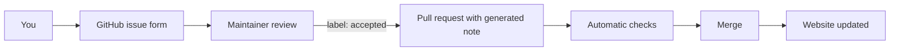

The Atlas lives in a public GitHub repository. Nobody edits the published knowledge directly — every change goes through review.

## Without Git: use a form

Pick a form on the [issue page]({{repo}}/issues/new/choose):

| Form | Use it to… |
| --- | --- |
| **Report a tool gap** | describe something you need to measure but have no good tool for — *the most valuable contribution* |
| Add a digital tool | propose software, hardware or a platform |
| Add a metric | propose a KPI, measure or threshold |
| Add a method | propose a measurement or evaluation method |
| Add a design challenge | propose a design problem with its design questions |
| Add a standard | propose a standard, regulation or guideline (paraphrased only) |
| Add a case study | share a worked example |
| Correct existing information | fix an error, add a source, report an outdated entry |

When a maintainer labels your issue **accepted**, a bot turns it into a note and opens a pull request. Your contribution enters the Atlas as `status: proposed`, `origin: community`.

## With Git and Obsidian

1. Fork the repository, open `content/` in Obsidian, create notes from `Templates/`.
2. Run `npm run validate` (optional — the checks also run on your pull request).
3. Open a pull request and fill in the checklist.

## Rules

- **Never copy text from standards.** Paraphrase the scope and link the official catalogue page.
- **Cite sources** for claims about what a tool measures, thresholds and limitations.
- **No marketing.** Describe limitations as clearly as capabilities.
- **One entity per note**, file name = title.

Full details: [CONTRIBUTING.md]({{repo}}/blob/main/CONTRIBUTING.md).
