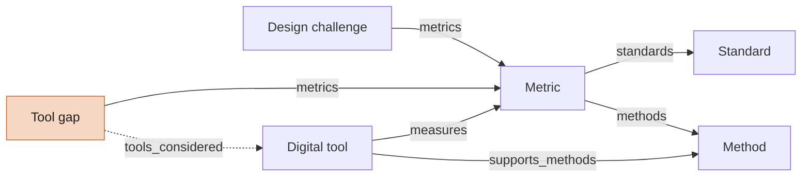
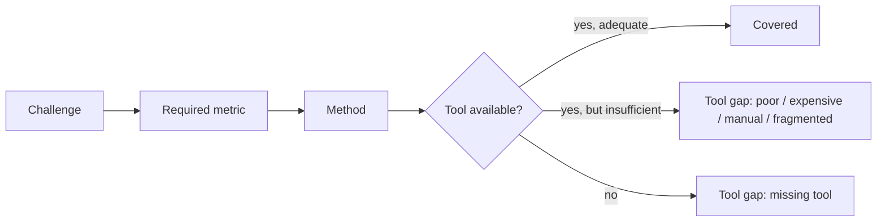

The Atlas is a small **ontology**: a fixed set of entity types with defined properties and relations. The folder structure only helps with browsing — the real structure lives in each note's **properties** (YAML frontmatter) as links between notes.

The machine-readable definition is [`schema/ontology.yml`]({{repo}}/blob/main/schema/ontology.yml). It is the single source of truth for the validator, the website build and the contribution forms.

## Entities and relations

A tool gap also links to the challenges and methods it affects. **Sources** back claims on every type, **case studies** link to all of them, and a standard can **supersede** an older edition.

Every relation is stored **once**, on the note that "knows" it best — a tool note says which metrics it measures; a metric note does not list tools. The reverse direction (*"Tools that can measure it"*) is computed and shown on the website under **Connections**, and in Obsidian in the backlinks panel.

## Entity types

| Type | Folder | Id | What it is | Key properties |
| --- | --- | --- | --- | --- |
| Design challenge | `Challenges/` | CH-… | A problem the designer is solving or avoiding. Contains the *design questions* as a section. | `metrics`, `related_challenges` |
| Metric | `Metrics/` | MET-… | A measurable characteristic: KPI, quantitative or qualitative measure, threshold, derived indicator. | `metric_kind`, `quantity`, `unit`, `methods`, `standards` |
| Standard | `Standards/` | STD-… | Standard, regulation or guideline. Referenced and paraphrased, never copied. | `code`, `publisher`, `provides`, `standard_status`, `supersedes` |
| Method | `Methods/` | MTH-… | A way of measuring or evaluating. | `method_kind` |
| Digital tool | `Tools/` | TOOL-… | A concrete software, hardware or platform product. | `tool_type`, `measures`, `supports_methods`, `cost_level`, `automation_level`, `setting` |
| Tool gap | `Gaps/` | GAP-… | Something designers need to measure but cannot do well with current tools. | `gap_type`, `impact`, `opportunity`, `challenges`, `metrics`, `methods`, `tools_considered` |
| Source | `Sources/` | SRC-… | Paper, book, catalogue page or documentation backing a claim. | `source_kind`, `authors`, `year`, `url`, `doi` |
| Case study | `Case studies/` | CASE-… | Worked example walking the full chain. | links to all of the above |

**Common properties on every note:** `id`, `title`, `domain`, `status`, `evidence_level`, `origin`, `last_verified`, `verified_by`, `sources` — see [[Trust levels]].

## Why standards, metrics and tools are separate

A standard is not a KPI. A standard may give a *definition*, a *process*, a *design requirement*, a *test method* or a *numeric limit*; the metric follows from it. Keeping them separate prevents the Atlas from becoming a mix of ISO numbers, KPIs and software names — and lets each evolve on its own (a standard gets a new edition, a tool gets discontinued) without breaking the rest.

## How gaps arise

The [[Gap register]] shows both **recorded gaps** (written up by people) and **gap candidates** computed from the structure — e.g. metrics that no tool measures.

## Domains

`usability` · `cognitive-ergonomics` · `physical-ergonomics` · `safety` · `accessibility` · `logistics` · `manufacturing` · `sustainability`. New domains are added in `schema/ontology.yml`.
