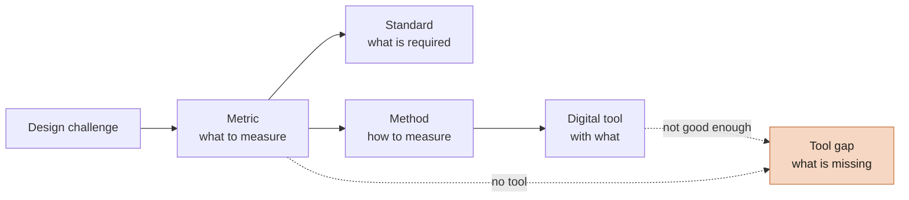

**The Design Challenge Atlas is an open, structured knowledge base.** It links the problems designers face to what can be measured, the standards that apply, the methods and digital tools that do the measuring — and shows where **no adequate tool exists yet**.

It does not only answer *"What software is out there?"*, but also:

> *"What do we need to know or measure — and have no good digital tool for?"*

## Start here

| I want to… | Go to |
| --- | --- |
| …solve a design problem: *what should I measure, how, with what?* | **[[Finder]]** |
| …see a full worked example | [[Machine operator emergency panel]] · [[Hand tool ergonomics]] |
| …find out which metrics lack a good tool | [[Metric coverage]] · [[Gap register]] |
| …browse tools | [[Tool directory]] |
| …check which standards apply and whether they are current | [[Standards register]] |
| …understand how the Atlas is built | [[Ontology]] · [[Trust levels]] |
| …add or correct something | [[How to contribute]] |

## What is inside (v0.1)

The pilot covers **human factors, usability and physical ergonomics**: design challenges, metrics, standards, methods, digital tools, tool gaps, sources and two case studies — all cross-linked. See [[Overviews]] for live counts.

> [!warning] Early prototype
> Every entry is currently **proposed** — written by the core team from cited sources, but not yet independently reviewed. Each page shows its review status and evidence level at the top. See [[Trust levels]].

## Two layers

- **Knowledge layer — what do we know?** Challenges, metrics, standards, methods, tools, evidence.
- **Opportunity layer — what don't we have?** [[Gap register|Tool gaps]]: missing, poor, expensive, manual or fragmented tooling. Useful for design researchers, tool developers and start-ups looking for real problems to solve.
